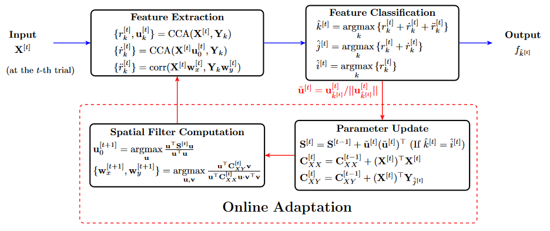

.. role::  raw-html(raw)
    :format: html

Recognition algorithms
-------------------------

.. _common-functions-in-methods:

Common methods for all models
^^^^^^^^^^^^^^^^^^^^^^^^^^^^^^^^^

All following recognition models have these methods. The inputs and outputs are same so they will not be repeatedly introduced in following sections. 

When you define your own algorithm class, You may use the ``BaseModel`` as the father class and re-define the ``__init__`` method and the following methods. 

.. py:function:: __copy__

    Copy the recognition model.

    :return:

        + ``model``: The returned new model is same as the original one.

.. py:function:: fit

    Train the recognition model. The trained model parameters will be stored in the class parameter ``model``. Different methods may require different input parameters. You may follow the below parameter names to define your own fit function. 

    :param X: List of training EEG signals. Each element is one 3D single trial EEG signal (filterbank :raw-html:`&#215;` channels :raw-html:`&#215;` samples).

    :param Y: List of training labels. Each element is one single trial label that is an integer number.

    :param ref_sig: List of reference signals. Each element is the reference signal of one stimulus. 

    :param freqs: List of stimulus frequencies. 

.. py:function:: predict

    Recognize the testing signals.

    :param X: List of testing EEG signals. Each element is one 3D single trial EEG signal (filterbank :raw-html:`&#215;` channels :raw-html:`&#215;` samples).

    :return:

        + ``Y_pred``: List of predicted labels for testing signals. Each element is one single trial label that is an integer number.

Standard CCA and filterbank CCA
^^^^^^^^^^^^^^^^^^^^^^^^^^^^^^^^^

Related papers: 

+ Standard CCA: Z. Lin et al., “Frequency recognition based on canonical correlation analysis for SSVEP-based BCIs,” IEEE Trans. Biomed. Eng., vol. 53, no. 12, pp. 2610-2614, 2006. DOI: `10.1109/TBME.2006.886577 <https://doi.org/10.1109/TBME.2006.886577>`_.
+ Filterbank CCA: X. Chen et al., “Filter bank canonical correlation analysis for implementing a high-speed SSVEP-based brain-computer interface,” J. Neural Eng., vol. 12, no. 4, p. 046008, 2015. DOI: `10.1088/1741-2560/12/4/046008 <https://doi.org/10.1088/1741-2560/12/4/046008>`_.

In this toolbox, the standard CCA (sCCA) are regarded as a special case of the filterbank CCA (FBCCA) that only have one filterbank. Spatial filters are found to maximize the similarity between the EEG signals and the sine-cosine-based reference signals, which can be presented as

.. math::

    \mathbf{U}_i, \mathbf{V}_i = \arg\max_{\mathbf{u},\mathbf{v}}\frac{\mathbf{u}^T\mathbf{X}\mathbf{Y}_i^T\mathbf{v}}{\sqrt{\mathbf{u}^T\mathbf{X}\mathbf{X}^T\mathbf{u}\mathbf{v}^T\mathbf{Y}_i\mathbf{Y}_i^T\mathbf{v}}}

where :math:`\mathbf{X}` denotes the testing multi-channel EEG signal, :math:`\mathbf{Y}_i` denotes the sine-cosine-based reference signal of the :math:`i\text{-th}` stimulus, :math:`\mathbf{U}_i` is the spatial filter of the :math:`i\text{-th}` stimulus, and :math:`\mathbf{V}_i` is the harmonic weights of the reference signal for the :math:`i\text{-th}` stimulus.

The stimulus with the highest similarity is regarded as the target:

.. math::

    \arg\max_{i\in\left\{1,2,\cdots,I\right\}}\left\{ \frac{\mathbf{U}_i^T\mathbf{X}\mathbf{Y}_i^T\mathbf{V}_i}{\sqrt{\mathbf{U}_i^T\mathbf{X}\mathbf{X}^T\mathbf{U}_i\mathbf{V}_i^T\mathbf{Y}_i\mathbf{Y}_i^T\mathbf{V}_i}} \right\}

where :math:`I` denotes the total number of stimuli.

.. py:function:: SSVEPAnalysisToolbox.algorithms.SCCA_canoncorr

    FBCCA implemented directly following above equations.

    :param n_component: Number of components of eigen vectors that will be applied as the spatial filters. The default number is ``1``, which means the eigen vector with the highest eigen value is regarded as the spatial filter.

    :param n_jobs: Number of threadings. If the given value is larger than 1, the parallel computation will be applied to improve the computational speed. Default is ``None``, which means the parallel computation will not be applied. 

    :param weights_filterbank: Weights of filterbanks. It is a list of float numbers. Default is ``None``, which means all weights of filterbanks are 1.

    :param force_output_UV: If ``True``, :math:`\left\{\mathbf{U}_i,\mathbf{V}_i\right\}_{i=1,2,\cdots,I}` will be stored. Otherwise, they will not be stored. Default is ``False``.

    :param update_UV: If ``True``, :math:`\left\{\mathbf{U}_i,\mathbf{V}_i\right\}_{i=1,2,\cdots,I}` will be re-computed in following testing trials. Otherwise, they will not be re-computed if they are already existed. Default is ``True``.

.. py:function:: SSVEPAnalysisToolbox.algorithms.SCCA_qr

    FBCCA implemented by the QR decomposition. This implementation is almost same as the `"SCCA_canoncorr" model <#SSVEPAnalysisToolbox.algorithms.SCCA_canoncorr>`_. The only difference is that this implementation does not repeatedly compute the QR decomposition of reference signals, which can improve the computational efficiency.

    :param n_component: Number of components of eigen vectors that will be applied as the spatial filters. The default number is ``1``, which means the eigen vector with the highest eigen value is regarded as the spatial filter.

    :param n_jobs: Number of threadings. If the given value is larger than 1, the parallel computation will be applied to improve the computational speed. Default is ``None``, which means the parallel computation will not be applied. 

    :param weights_filterbank: Weights of filterbanks. It is a list of float numbers. Default is ``None``, which means all weights of filterbanks are 1.

    :param force_output_UV: If ``True``, :math:`\left\{\mathbf{U}_i,\mathbf{V}_i\right\}_{i=1,2,\cdots,I}` will be stored. Otherwise, they will not be stored. Default is ``False``.

    :param update_UV: If ``True``, :math:`\left\{\mathbf{U}_i,\mathbf{V}_i\right\}_{i=1,2,\cdots,I}` will be re-computed in following testing trials. Otherwise, they will not be re-computed if they are already existed. Default is ``True``.

.. note::

    Although the FBCCA is a training-free method, these models still need run `"fit" function <#fit>`_ to store reference signals in the model.

Individual template CCA (itCCA) and extended CCA (eCCA)
^^^^^^^^^^^^^^^^^^^^^^^^^^^^^^^^^^^^^^^^^^^^^^^^^^^^^^^^^^^

Related paper:

    + X. Chen, Y. Wang, M. Nakanishi, X. Gao, T.-P. Jung, and S. Gao, "High-speed spelling with a noninvasive brain-computer interface," *Proc. Natl. Acad. Sci.*, vol. 112, no. 44, pp. E6058-E6067, 2015. DOI: `10.1073/pnas.1508080112 <https://doi.org/10.1073/pnas.1508080112>`_.

The itCCA is similar as the sCCA, but it uses the averaged template signals to compute the spatial filters. The corresponding correlation coefficient is 

.. math::

    r = \max_{\mathbf{u},\mathbf{v}}\frac{\mathbf{u}^T\mathbf{X}\overline{\mathbf{X}}_i^T\mathbf{v}}{\sqrt{\mathbf{u}^T\mathbf{X}\mathbf{X}^T\mathbf{u}\mathbf{v}^T\mathbf{X}\overline{\mathbf{X}}_i^T\mathbf{v}}}

where :math:`\overline{\mathbf{X}}_i` denotes the averaged template signal of the :math:`i\text{-th}` stimulus. 

The eCCA not only applies the sine-cosine-based reference signals but also uses the averaged template signals. Three types of spatial filters are computed:

.. math::

    \mathbf{U}_{1,i}, \mathbf{V}_{1,i} = \arg\max_{\mathbf{u},\mathbf{v}}\frac{\mathbf{u}^T\mathbf{X}\mathbf{Y}_i^T\mathbf{v}}{\sqrt{\mathbf{u}^T\mathbf{X}\mathbf{X}^T\mathbf{u}\mathbf{v}^T\mathbf{Y}_i\mathbf{Y}_i^T\mathbf{v}}}

.. math::

    \mathbf{U}_{2,i}, \mathbf{V}_{2,i} = \arg\max_{\mathbf{u},\mathbf{v}}\frac{\mathbf{u}^T\mathbf{X}\overline{\mathbf{X}}_i^T\mathbf{v}}{\sqrt{\mathbf{u}^T\mathbf{X}\mathbf{X}^T\mathbf{u}\mathbf{v}^T\mathbf{X}\overline{\mathbf{X}}_i^T\mathbf{v}}}

.. math::

    \mathbf{U}_{3,i}, \mathbf{V}_{3,i} = \arg\max_{\mathbf{u},\mathbf{v}}\frac{\mathbf{u}^T\overline{\mathbf{X}}_i\mathbf{Y}_i^T\mathbf{v}}{\sqrt{\mathbf{u}^T\overline{\mathbf{X}}_i\overline{\mathbf{X}}_i^T\mathbf{u}\mathbf{v}^T\mathbf{Y}_i\mathbf{Y}_i^T\mathbf{v}}}

Four types of corresponding correlation coefficients can be computed:

.. math::

    r_{1,i} = \frac{\mathbf{U}_{1,i}^T\mathbf{X}\mathbf{Y}_i^T\mathbf{V}_{1,i}}{\sqrt{\mathbf{U}_{1,i}^T\mathbf{X}\mathbf{X}^T\mathbf{U}_{1,i}\mathbf{V}_{1,i}^T\mathbf{Y}_i\mathbf{Y}_i^T\mathbf{V}_{1,i}}}

.. math::

    r_{2,i} = \frac{\mathbf{U}_{2,i}^T\mathbf{X}\overline{\mathbf{X}}_i^T\mathbf{U}_{2,i}}{\sqrt{\mathbf{U}_{2,i}^T\mathbf{X}\mathbf{X}^T\mathbf{U}_{2,i}\mathbf{U}_{2,i}^T\overline{\mathbf{X}}_i\overline{\mathbf{X}}_i^T\mathbf{U}_{2,i}}}

.. math::

    r_{3,i} = \frac{\mathbf{U}_{1,i}^T\mathbf{X}\overline{\mathbf{X}}_i^T\mathbf{U}_{1,i}}{\sqrt{\mathbf{U}_{1,i}^T\mathbf{X}\mathbf{X}^T\mathbf{U}_{1,i}\mathbf{U}_{1,i}^T\overline{\mathbf{X}}_i\overline{\mathbf{X}}_i^T\mathbf{U}_{1,i}}}

.. math::

    r_{4,i} = \frac{\mathbf{U}_{3,i}^T\mathbf{X}\overline{\mathbf{X}}_i^T\mathbf{U}_{3,i}}{\sqrt{\mathbf{U}_{3,i}^T\mathbf{X}\mathbf{X}^T\mathbf{U}_{3,i}\mathbf{U}_{3,i}^T\overline{\mathbf{X}}_i\overline{\mathbf{X}}_i^T\mathbf{U}_{3,i}}}

The target stimulus is predicted by combining four correlation coefficients together:

.. math::

    \arg\max_{i\in\left\{1,2,\cdots,I\right\}}\left\{ \sum_{k=1}^4 \text{sign}\left\{r_{k,i}\right\}\cdot r_{k,i}^2 \right\}

where :math:`\text{sign}\left\{\cdot\right\}` is the `signum function <https://en.wikipedia.org/wiki/Sign_function>`_.

.. py:function:: SSVEPAnalysisToolbox.algorithms.ITCCA

    ITCCA. The implementation is similar as the `"SCCA_qr" model <#SSVEPAnalysisToolbox.algorithms.SCCA_qr>`_.

    :param n_component: Number of components of eigen vectors that will be applied as the spatial filters. The default number is ``1``, which means the eigen vector with the highest eigen value is regarded as the spatial filter.

    :param n_jobs: Number of threadings. If the given value is larger than 1, the parallel computation will be applied to improve the computational speed. Default is ``None``, which means the parallel computation will not be applied. 

    :param weights_filterbank: Weights of filterbanks. It is a list of float numbers. Default is ``None``, which means all weights of filterbanks are 1.

    :param force_output_UV: If ``True``, :math:`\left\{\mathbf{U}_i,\mathbf{V}_i\right\}_{i=1,2,\cdots,I}` will be stored. Otherwise, they will not be stored. Default is ``False``.

    :param update_UV: If ``True``, :math:`\left\{\mathbf{U}_i,\mathbf{V}_i\right\}_{i=1,2,\cdots,I}` will be re-computed in following testing trials. Otherwise, they will not be re-computed if they are already existed. Default is ``True``.

.. py:function:: SSVEPAnalysisToolbox.algorithms.ECCA

    eCCA. The implementation is similar as the `"SCCA_qr" model <#SSVEPAnalysisToolbox.algorithms.SCCA_qr>`_.

    :param n_component: Number of components of eigen vectors that will be applied as the spatial filters. The default number is ``1``, which means the eigen vector with the highest eigen value is regarded as the spatial filter.

    :param n_jobs: Number of threadings. If the given value is larger than 1, the parallel computation will be applied to improve the computational speed. Default is ``None``, which means the parallel computation will not be applied. 

    :param weights_filterbank: Weights of filterbanks. It is a list of float numbers. Default is ``None``, which means all weights of filterbanks are 1.

    :param update_UV: If ``True``, :math:`\left\{\mathbf{U}_i,\mathbf{V}_i\right\}_{i=1,2,\cdots,I}` will be re-computed in following training and testing trials. Otherwise, they will not be re-computed if they are already existed. Default is ``True``.

Multi-stimulus CCA
^^^^^^^^^^^^^^^^^^^

Related paper:

+ C. M. Wong, F. Wan, B. Wang, Z. Wang, W. Nan, K. F. Lao, P. U. Mak, M. I. Vai, and A. Rosa, "Learning across multi-stimulus enhances target recognition methods in SSVEP-based BCIs," *J. Neural Eng.*, vol. 17, no. 1, p. 016026, 2020. DOI: `10.1088/1741-2552/ab2373 <https://doi.org/10.1088/1741-2552/ab2373>`_.

The multi-stimulus CCA (ms-CCA) considers reference signals and template signals of target stimulus and stimuli with stimulus frequencies are close to that of target stimulus, which includes the phase information and thus improve the recognition accuracy. The spatial filters are computed by

.. math::

    \mathbf{U}_i, \mathbf{V}_i = \arg\max_{\mathbf{u},\mathbf{v}}\frac{\mathbf{u}^T\mathbf{A}_i\mathbf{B}_i^T\mathbf{v}}{\sqrt{\mathbf{u}^T\mathbf{A}_i\mathbf{A}_i^T\mathbf{u}\mathbf{v}^T\mathbf{B}_i\mathbf{B}_i^T\mathbf{v}}}

where :math:`\mathbf{A}_i` is the concatenated template signal defined as :math:`\mathbf{A}_i = \left[\overline{\mathbf{X}}_{i-m},\cdots,\overline{\mathbf{X}}_{i},\cdots,\overline{\mathbf{X}}_{i+n}\right]`, and :math:`\mathbf{B}_i` is the concatenated reference signal defined as :math:`\mathbf{A}_i = \left[\mathbf{Y}_{i-m},\cdots,\mathbf{Y}_{i},\cdots,\mathbf{Y}_{i+n}\right]`.

Two types of correlation coefficients are computed:

.. math::

    r_{1,i} = \frac{\mathbf{U}_{i}^T\mathbf{X}\mathbf{Y}_i^T\mathbf{V}_{i}}{\sqrt{\mathbf{U}_{i}^T\mathbf{X}\mathbf{X}^T\mathbf{U}_{i}\mathbf{V}_{i}^T\mathbf{Y}_i\mathbf{Y}_i^T\mathbf{V}_{i}}}

.. math::

    r_{2,i} = \frac{\mathbf{U}_{i}^T\mathbf{X}\overline{\mathbf{X}}_i^T\mathbf{U}_{i}}{\sqrt{\mathbf{U}_{i}^T\mathbf{X}\mathbf{X}^T\mathbf{U}_{i}\mathbf{U}_{i}^T\overline{\mathbf{X}}_i\overline{\mathbf{X}}_i^T\mathbf{U}_{i}}}

The target stimulus is predicted by combining two correlation coefficients:

.. math::

    \arg\max_{i\in\left\{1,2,\cdots,I\right\}}\left\{ \sum_{k=1}^2 \text{sign}\left\{r_{k,i}\right\}\cdot r_{k,i}^2 \right\}

.. py:function:: SSVEPAnalysisToolbox.algorithms.MSCCA

    ms-CCA. The implementation directly follows above equations.

    :param n_neighbor: Number of neighbers considered for computing the spatial filter of one stimulus. Default is ``12``.

    :param n_component: Number of components of eigen vectors that will be applied as the spatial filters. The default number is ``1``, which means the eigen vector with the highest eigen value is regarded as the spatial filter.

    :param n_jobs: Number of threadings. If the given value is larger than 1, the parallel computation will be applied to improve the computational speed. Default is ``None``, which means the parallel computation will not be applied. 

    :param weights_filterbank: Weights of filterbanks. It is a list of float numbers. Default is ``None``, which means all weights of filterbanks are 1.

Multi-set CCA (MsetCCA)
^^^^^^^^^^^^^^^^^^^^^^^^^^^^^

Related paper:

+ Y. Zhang, G. Zhou, J. Jin, X. Wang, A. Cichocki, "Frequency recognition in SSVEP-based BCI using multiset canonical correlation analysis," *Int J Neural Syst.*, vol. 24, 2014, p. 1450013. DOI: `10.1142/ S0129065714500130 <https://www.worldscientific.com/doi/abs/10.1142/S0129065714500130>`_.

For each stimulus, the MsetCCA maximize the inter-trial covariance to compute the spatial filters. The spatial filters of different trials are different.

.. math::

    \widetilde{\mathbf{w}}_{i,1}, \cdots, \widetilde{\mathbf{w}}_{i,N_t}=\arg\max_{\mathbf{w}_1,\cdots,\mathbf{w}_{N_t}}\sum_{h_1=1}^{N_t}\sum_{h_2=1,h_1\neq h_2}^{N_t}\mathbf{w}_{h_1}^T\cal{X}_{i,h_1}\cal{X}_{i,h_2}^T\mathbf{w}_{h_2}

.. math:: 

    \text{subject to }\frac{1}{N_t} \sum_{h_1=1}^{N_t}\sum_{h_2=1,h_1\neq h_2}^{N_t}\mathbf{w}_{h_1}^T\cal{X}_{i,h_1}\cal{X}_{i,h_2}^T\mathbf{w}_{h_2} = 1

where :math:`\widetilde{\mathbf{w}}_{i,n}` denotes the spatial filter of the :math:`i\text{-th}` stimulus and the :math:`n\text{-th}` training trial, :math:`N_t` denotes the number of training trials, and :math:`\cal{X}_{i,n}` denotes the calibration data of the :math:`i\text{-th}` stimulus and the :math:`n\text{-th}` training trial.

Solving this optimization problem is equivalent to solving the following eigenvalue problem:

.. math:: 

    \left( \mathbf{R}_i-\mathbf{S}_i \right)\mathbf{w} = \rho\mathbf{S}_i\mathbf{w}

where 

.. math:: 

    \mathbf{R}_i = \left[  
                    \begin{array}{ccc}
                        \cal{X}_{i,1}\cal{X}_{i,1}^T & \cdots & \cal{X}_{i,1}\cal{X}_{i,N_t}^T\\
                        \vdots & \ddots & \vdots\\
                        \cal{X}_{i,N_t}\cal{X}_{i,1}^T & \cdots & \cal{X}_{i,N_t}\cal{X}_{i,N_t}^T
                    \end{array}
                   \right]

.. math:: 

    \mathbf{S}_i = \left[  
                    \begin{array}{ccc}
                        \cal{X}_{i,1}\cal{X}_{i,1}^T & \cdots & 0\\
                        \vdots & \ddots & \vdots\\
                        0 & \cdots & \cal{X}_{i,N_t}\cal{X}_{i,N_t}^T
                    \end{array}
                   \right]

.. math:: 

    \mathbf{w} = \left[ \mathbf{w}_1, \cdots, \mathbf{w}_{N_t} \right]^T.

.. py:function:: SSVEPAnalysisToolbox.algorithms.MsetCCA

    Multi-set CCA. The implementation directly follows above equations.

    :param n_jobs: Number of threadings. If the given value is larger than 1, the parallel computation will be applied to improve the computational speed. Default is ``None``, which means the parallel computation will not be applied. 

    :param weights_filterbank: Weights of filterbanks. It is a list of float numbers. Default is ``None``, which means all weights of filterbanks are 1.

Multi-set CCA with reference signals (MsetCCA-R)
^^^^^^^^^^^^^^^^^^^^^^^^^^^^^^^^^^^^^^^^^^^^^^^^^^

Related paper:

+ C. M. Wong, B. Wang, Z. Wang, K. F. Lao, A. Rosa, and F. Wan, "Spatial filtering in SSVEP-based BCIs: Unified framework and new improvements.," *IEEE Transactions on Biomedical Engineering*, vol. 67, no. 11, pp. 3057-3072, 2020. DOI: `10.1109/TBME.2020.2975552 <https://ieeexplore.ieee.org/document/9006809/>`_.

The MsetCCA-R is an extension of the `MsetCCA <#multi-set-cca-msetcca>`_. It also tries to solve the following eigenvalue problem to find the spatial filters:

.. math:: 

    \left( \mathbf{R}^{\left[Q\right]}_i-\mathbf{S}^{\left[Q\right]}_i \right)\mathbf{w} = \rho\mathbf{S}_i\mathbf{w}.

The key differences are the following two values:

.. math:: 

    \mathbf{R}^{\left[Q\right]}_i = \left[  
                    \begin{array}{ccc}
                        \cal{X}_{i,1}\mathbf{Q}_i^T\mathbf{Q}_i\cal{X}_{i,1}^T & \cdots & \cal{X}_{i,1}\mathbf{Q}_i^T\mathbf{Q}_i\cal{X}_{i,N_t}^T\\
                        \vdots & \ddots & \vdots\\
                        \cal{X}_{i,N_t}\mathbf{Q}_i^T\mathbf{Q}_i\cal{X}_{i,1}^T & \cdots & \cal{X}_{i,N_t}\mathbf{Q}_i^T\mathbf{Q}_i\cal{X}_{i,N_t}^T
                    \end{array}
                   \right]

and

.. math:: 

    \mathbf{S}^{\left[Q\right]}_i = \left[  
                    \begin{array}{ccc}
                        \cal{X}_{i,1}\mathbf{Q}_i^T\mathbf{Q}_i\cal{X}_{i,1}^T & \cdots & 0\\
                        \vdots & \ddots & \vdots\\
                        0 & \cdots & \cal{X}_{i,N_t}\mathbf{Q}_i^T\mathbf{Q}_i\cal{X}_{i,N_t}^T
                    \end{array}
                   \right]

where :math:`\mathbf{Q}_i` is the QR decomposition of the :math:`i\text{-th}` stimulus reference signal:

.. math::

    \mathbf{Q}_i\mathbf{R}_i = \mathbf{Y}_i

.. py:function:: SSVEPAnalysisToolbox.algorithms.MsetCCAwithR

    Multi-set CCA with reference signals. The implementation directly follows above equations.

    :param n_jobs: Number of threadings. If the given value is larger than 1, the parallel computation will be applied to improve the computational speed. Default is ``None``, which means the parallel computation will not be applied. 

    :param weights_filterbank: Weights of filterbanks. It is a list of float numbers. Default is ``None``, which means all weights of filterbanks are 1.

Task-related component analysis (TRCA) and ensemble TRCA (eTRCA)
^^^^^^^^^^^^^^^^^^^^^^^^^^^^^^^^^^^^^^^^^^^^^^^^^^^^^^^^^^^^^^^^^^

Related paper:

+ M. Nakanishi, Y. Wang, X. Chen, Y.-T. Wang, X. Gao, and T.-P. Jung, "Enhancing detection of SSVEPs for a high-speed brain speller using task-related component Analysis," *IEEE Trans. Biomed. Eng.*, vol. 65, no. 1, pp. 104-112, 2018. DOI: `10.1109/TBME.2017.2694818 <https://doi.org/10.1109/TBME.2017.2694818>`_.

For each stimulus, the TRCA and the ensemble TRCA (eTRCA) maximize the inter-trial covariance to compute the common spatial filter across trials, which can be achieved by solving

.. math::

    \left( \sum_{j,k=1,\; j\neq k}^{N_t} \mathbf{X}_i^{(j)}\left(\mathbf{X}_i^{(k)}\right)^T \right)\mathbf{U}_i = \left( \sum_{j=1}^{N_t} \mathbf{X}_i^{(j)}\left(\mathbf{X}_i^{(j)}\right)^T \right) \mathbf{U}_i\mathbf{\Lambda}_i

where :math:`\mathbf{X}_i^{(j)}` denotes the :math:`j\text{-th}` trial training EEG signals of :math:`i\text{-th}` stimulus.

The target stimulus can be predicted by 

.. math::

    \arg\max_{i\in\left\{1,2,\cdots,I\right\}}\left\{ \frac{\mathbf{U}_i^T\mathbf{X}\overline{\mathbf{X}}_i^T\mathbf{U}_i}{\sqrt{\mathbf{U}_i^T\mathbf{X}\mathbf{X}^T\mathbf{U}_i\mathbf{U}_i^T\overline{\mathbf{X}}_i\overline{\mathbf{X}}_i^T\mathbf{U}_i}} \right\}

.. py:function:: SSVEPAnalysisToolbox.algorithms.TRCA

    TRCA. The implementation directly follows above equations.

    :param n_component: Number of components of eigen vectors that will be applied as the spatial filters. The default number is ``1``, which means the eigen vector with the highest eigen value is regarded as the spatial filter.

    :param n_jobs: Number of threadings. If the given value is larger than 1, the parallel computation will be applied to improve the computational speed. Default is ``None``, which means the parallel computation will not be applied. 

    :param weights_filterbank: Weights of filterbanks. It is a list of float numbers. Default is ``None``, which means all weights of filterbanks are 1.

.. py:function:: SSVEPAnalysisToolbox.algorithms.ETRCA

    eTRCA. The spatial computation is same as the TRCA. The only difference is that the recognition uses the same set of spatial filters for all stimuli. This set of saptial filters contain all eigen vectors with the highest eigen value of all stimuli.

    :param n_component: This parameter will not be considered in the eTRCA. 

    :param n_jobs: Number of threadings. If the given value is larger than 1, the parallel computation will be applied to improve the computational speed. Default is ``None``, which means the parallel computation will not be applied. 

    :param weights_filterbank: Weights of filterbanks. It is a list of float numbers. Default is ``None``, which means all weights of filterbanks are 1.

TRCA with reference signals (TRCA-R) and eTRCA with reference signals (eTRCA-R)
^^^^^^^^^^^^^^^^^^^^^^^^^^^^^^^^^^^^^^^^^^^^^^^^^^^^^^^^^^^^^^^^^^^^^^^^^^^^^^^^^^

Related paper:

+ C. M. Wong, B. Wang, Z. Wang, K. F. Lao, A. Rosa, and F. Wan, "Spatial filtering in SSVEP-based BCIs: Unified framework and new improvements.," *IEEE Transactions on Biomedical Engineering*, vol. 67, no. 11, pp. 3057-3072, 2020. DOI: `10.1109/TBME.2020.2975552 <https://ieeexplore.ieee.org/document/9006809/>`_.

The TRCA-R and the eTRCA-R are extensions of `the TRCA and the eTRCA <#task-related-component-analysis-trca-and-ensemble-trca-etrca>`_ respectively. They try to find the spatial filters by solving 

.. math::

    \left( \sum_{j,k=1,\; j\neq k}^{N_t} \mathbf{X}_i^{(j)}\mathbf{Q}_i^T\mathbf{Q}_i\left(\mathbf{X}_i^{(k)}\right)^T \right)\mathbf{U}_i = \left( \sum_{j=1}^{N_t} \mathbf{X}_i^{(j)}\left(\mathbf{X}_i^{(j)}\right)^T \right) \mathbf{U}_i\mathbf{\Lambda}_i

where :math:`\mathbf{X}_i^{(j)}` denotes the :math:`j\text{-th}` trial training EEG signals of :math:`i\text{-th}` stimulus, and :math:`\mathbf{Q}_i` is obtained from the QR decomposition of the reference signals following `the MsetCCA-R <#multi-set-cca-with-reference-signals-msetcca-r>`_.

.. py:function:: SSVEPAnalysisToolbox.algorithms.TRCAwithR

    TRCA-R. The implementation directly follows above equations.

    :param n_component: Number of components of eigen vectors that will be applied as the spatial filters. The default number is ``1``, which means the eigen vector with the highest eigen value is regarded as the spatial filter.

    :param n_jobs: Number of threadings. If the given value is larger than 1, the parallel computation will be applied to improve the computational speed. Default is ``None``, which means the parallel computation will not be applied. 

    :param weights_filterbank: Weights of filterbanks. It is a list of float numbers. Default is ``None``, which means all weights of filterbanks are 1.

.. py:function:: SSVEPAnalysisToolbox.algorithms.ETRCAwithR

    eTRCA-R. The spatial computation is same as the TRCA-R. The only difference is that the recognition uses the same set of spatial filters for all stimuli. This set of saptial filters contain all eigen vectors with the highest eigen value of all stimuli.

    :param n_component: This parameter will not be considered in the eTRCA-R. 

    :param n_jobs: Number of threadings. If the given value is larger than 1, the parallel computation will be applied to improve the computational speed. Default is ``None``, which means the parallel computation will not be applied. 

    :param weights_filterbank: Weights of filterbanks. It is a list of float numbers. Default is ``None``, which means all weights of filterbanks are 1.

Sum of squared correlations (SSCOR) and Ensemble sum of squared correlations (eSSCOR)
^^^^^^^^^^^^^^^^^^^^^^^^^^^^^^^^^^^^^^^^^^^^^^^^^^^^^^^^^^^^^^^^^^^^^^^^^^^^^^^^^^^^^^^^

Related paper:

+ G. K. Kumar, and M. R. Reddy, "Designing a sum of squared correlations framework for enhancing SSVEP-based BCIs," *IEEE Transactions on Neural Systems and Rehabilitation Engineering*, vol. 27, no. 10, pp. 2044-2050, 2019. DOI: `10.1109/TNSRE.2019.2941349 <https://doi.org/10.1109/TNSRE.2019.2941349>`_.

The key idea of the SSCOR is similar as the TRCA. The SSCOR also finds the common spatial filter across trials, but it assumes the spatial filters of differet trials are different. The SSCOR computes the common spatial filter :math:`\mathbf{U}_i` and the spatial filter :math:`\mathbf{U}_i^{(j)}` of the :math:`j\text{-th}` trial for the :math:`i\text{-th}` stimulus by solving

.. math:: 

    \max_{\mathbf{U}_i\text{ and }\mathbf{U}_i^{(j)}}\sum_{j=1}^{N_t}\left( \mathbf{U}_i^T\overline{\mathbf{X}}_i\left(\mathbf{X}_i^{(j)}\right)^T\mathbf{U}_i^{(j)} \right)^2

.. math:: 

    \text{subject to} \left\{ 
                        \begin{array}{l} 
                            \mathbf{U}_i^T\overline{\mathbf{X}}_i\left( \overline{\mathbf{X}}_i \right)^T\mathbf{U}_i=\mathbf{I}\\
                            \left(\mathbf{U}_i^{(j)}\right)^T\mathbf{X}_i^{(j)}\left(\mathbf{X}_i^{(j)}\right)^T\mathbf{U}_i^{(j)}=\mathbf{I}\;\;\forall j\in\left\{ 1,\cdots,N_t \right\}
                        \end{array}
                       \right.

Based on the `Cholesky decomposition <https://en.wikipedia.org/wiki/Cholesky_decomposition>`_, we have

.. math:: 

    \mathbf{C}_i^{\overline{\mathbf{X}}} = \left(\mathbf{K}_i^{\overline{\mathbf{X}}}\right)^T\mathbf{K}_i^{\overline{\mathbf{X}}} \text{ where } \mathbf{C}_i^{\overline{\mathbf{X}}} = \overline{\mathbf{X}}_i\left( \overline{\mathbf{X}}_i \right)^T

.. math:: 

    \mathbf{C}_{i,j}^{\mathbf{X}} = \left(\mathbf{K}_{i,j}^{\mathbf{X}}\right)^T\mathbf{K}_{i,j}^{\mathbf{X}} \text{ where } \mathbf{C}_{i,j}^{\mathbf{X}} = \mathbf{X}_i^{(j)}\left( \mathbf{X}_i^{(j)} \right)^T

Let's define :math:`\mathbf{U}_i = \left(\mathbf{K}_i^{\overline{\mathbf{X}}}\right)^{-1}\mathbf{V}_i`, :math:`\mathbf{U}_i^{(j)} = \left( \mathbf{K}_{i,j}^{\mathbf{X}} \right)^{-1}\mathbf{V}_i^{(j)}`, :math:`\mathbf{G}_i^{(j)}=\left(\mathbf{K}_i^{\overline{\mathbf{X}}}\right)^{-T}\mathbf{C}_{i,j}^{\overline{\mathbf{X}}}\left(\mathbf{K}_{i,j}^{\mathbf{X}}\right)^{-1}`, and :math:`\mathbf{C}_{i,j}^{\overline{\mathbf{X}}} = \overline{\mathbf{X}}_i\left( \mathbf{X}_i^{(j)} \right)^T`, we get

.. math:: 

    \max_{\mathbf{V}_i} \sum_{j=1}^{N_t}\mathbf{V}_i^T\mathbf{G}_i^{(j)}\left(\mathbf{G}_i^{(j)}\right)^T\mathbf{V}_i

.. math:: 

    \text{subject to } \mathbf{V}_i^T\mathbf{V}_i=\mathbf{I}

:math:`\mathbf{V}_i` can be calculated by solving

.. math:: 

    \left( \sum_{j=1}^{N_t}\mathbf{G}_i^{(j)}\left(\mathbf{G}_i^{(j)}\right)^T \right)\mathbf{V}_i = \mathbf{V}_i\mathbf{\Lambda}_i

.. py:function:: SSVEPAnalysisToolbox.algorithms.SSCOR

    SSCOR. The implementation directly follows above equations.

    :param n_component: Number of components of eigen vectors that will be applied as the spatial filters. The default number is ``1``, which means the eigen vector with the highest eigen value is regarded as the spatial filter.

    :param n_jobs: Number of threadings. If the given value is larger than 1, the parallel computation will be applied to improve the computational speed. Default is ``None``, which means the parallel computation will not be applied. 

    :param weights_filterbank: Weights of filterbanks. It is a list of float numbers. Default is ``None``, which means all weights of filterbanks are 1.

.. py:function:: SSVEPAnalysisToolbox.algorithms.ESSCOR

    eSSCOR. The spatial computation is same as the SSCOR. The only difference is that the recognition uses the same set of spatial filters for all stimuli. This set of saptial filters contain all eigen vectors with the highest eigen value of all stimuli.

    :param n_component: This parameter will not be considered in the eTRCA. 

    :param n_jobs: Number of threadings. If the given value is larger than 1, the parallel computation will be applied to improve the computational speed. Default is ``None``, which means the parallel computation will not be applied. 

    :param weights_filterbank: Weights of filterbanks. It is a list of float numbers. Default is ``None``, which means all weights of filterbanks are 1.

Multi-stimulus TRCA
^^^^^^^^^^^^^^^^^^^^^^

Related paper:

+ C. M. Wong, F. Wan, B. Wang, Z. Wang, W. Nan, K. F. Lao, P. U. Mak, M. I. Vai, and A. Rosa, "Learning across multi-stimulus enhances target recognition methods in SSVEP-based BCIs," *J. Neural Eng.*, vol. 17, no. 1, p. 016026, 2020. DOI: `10.1088/1741-2552/ab2373 <https://doi.org/10.1088/1741-2552/ab2373>`_.

The multi-stimulus TRCA (ms-TRCA) is similar as the `ms-CCA <#multi-stimulus-cca>`_. It also considers training EEG signals of stimuli whose stimulus frequencies are close to the target stimulus to compute spatial filters:

.. math::

    \sum_{d=i-m}^{i+n}\left\{ \sum_{j,k=1,\; j\neq k}^{N_t} \mathbf{X}_d^{(j)}\left(\mathbf{X}_d^{(k)}\right)^T \right\}\mathbf{U}_i = \sum_{d=i-m}^{i+n}\left\{ \sum_{j=1}^{N_t} \mathbf{X}_d^{(j)}\left(\mathbf{X}_d^{(j)}\right)^T \right\} \mathbf{U}_i\mathbf{\Lambda}_i

.. py:function:: SSVEPAnalysisToolbox.algorithms.MSETRCA

    ms-TRCA. In this toolbox, the ms-TRCA follows the `eTRCA <#SSVEPAnalysisToolbox.algorithms.ETRCA>`_ scheme to emsemble spatial filters of all stimuli for the recognition. 

    :param n_neighbor: Number of neighbers considered for computing the spatial filter of one stimulus. Default is ``2``.

    :param n_component: This parameter will not be considered in this function. 

    :param n_jobs: Number of threadings. If the given value is larger than 1, the parallel computation will be applied to improve the computational speed. Default is ``None``, which means the parallel computation will not be applied. 

    :param weights_filterbank: Weights of filterbanks. It is a list of float numbers. Default is ``None``, which means all weights of filterbanks are 1.

.. py:function:: SSVEPAnalysisToolbox.algorithms.MSCCA_and_MSETRCA

    This method ensembles correlation coefficients of the `ms-CCA <#SSVEPAnalysisToolbox.algorithms.MSCCA>`_ and the `ms-TRCA <#SSVEPAnalysisToolbox.algorithms.MSETRCA>`_ to recognize the target stimulus. Suppose that :math:`r_{1,i}` and :math:`r_{2,i}` are correlation coefficients obtained from the ms-CCA and the ms-TRCA respectively, then the ensembled correlation coefficient is 

    .. math::

        r_\text{ms-CCA + ms-TRCA} = \sum_{k=1}^2 \text{sign}\left\{r_{k,i}\right\}\cdot r_{k,i}^2 

    :param n_neighbor_mscca: Number of neighbers considered for computing the spatial filter of one stimulus in the ms-CCA. Default is ``12``.

    :param n_neighber_msetrca: Number of neighbers considered for computing the spatial filter of one stimulus in the ms-TRCA. Default is ``2``.

    :param n_component: Number of components of eigen vectors that will be applied as the spatial filters in the ms-CCA. The default number is ``1``, which means the eigen vector with the highest eigen value is regarded as the spatial filter.

    :param n_jobs: Number of threadings. If the given value is larger than 1, the parallel computation will be applied to improve the computational speed. Default is ``None``, which means the parallel computation will not be applied. 

    :param weights_filterbank: Weights of filterbanks. It is a list of float numbers. Default is ``None``, which means all weights of filterbanks are 1.

Task-discriminant component analysis
^^^^^^^^^^^^^^^^^^^^^^^^^^^^^^^^^^^^^^^

Related paper:

+ B. Liu, X. Chen, N. Shi, Y. Wang, S. Gao, X. Gao, "Improving the performance of individually calibrated SSVEP-BCI by task-discriminant component analysis." *IEEE Trans. Neural Syst. Rehabil. Eng.*, vol. 29, pp. 1998-2007, 2021. DOI: `10.1109/TNSRE.2021.3114340 <https://doi.org/10.1109/TNSRE.2021.3114340>`_.

Compared with other methods, the task-discriminant component analysis (TDCA) have following three key differences:

1. The dimensionality of EEG signals is elevated. For one trial EEG signal :math:`\mathbf{X}`, the augmented EEG trial :math:`\widetilde{\mathbf{X}}` is

   .. math::
      
      \widetilde{\mathbf{X}} = \left[ \begin{array}{cc}
                                        \mathbf{X}, & \mathbf{O}_0\\
                                        \mathbf{X}_1, & \mathbf{O}_1\\
                                        \vdots & \\
                                        \mathbf{X}_L, & \mathbf{O}_L
                                      \end{array} \right]
   
   where :math:`\mathbf{X}_l` denotes the EEG trial delayed by :math:`l` points, :math:`\mathbf{O}_l\in\mathbb{R}^{N_\text{ch}\times l}` denotes the zero matrix, and :math:`L` is the total number of delays. 

2. After elevating the dimension, EEG trials are then further extended for each stimulus as

   .. math::

      \mathbf{X}_a = \left[ \widetilde{\mathbf{X}},\;\; \widetilde{\mathbf{X}}\mathbf{Q}_i\mathbf{Q}_i^T \right]

   where :math:`\mathbf{Q}_i` is the orthogonal factor of the reference signal of the :math:`i\text{-th}` stimulus and can be obtained by the QR decomposition :math:`\mathbf{Q}_i\mathbf{R}_i=\mathbf{Y}_i^T`.

3. The two-dimensional linear discriminant analysis is applied to compute spatial filters by solving

   .. math::

      \mathbf{S}_b\mathbf{U} = \mathbf{S}_w\mathbf{U}\mathbf{\Lambda}

   The :math:`\mathbf{S}_b` is the covariance of between-class differences:

   .. math::

      \mathbf{S}_b = \frac{1}{I} \sum_{i=1}^I \left( \overline{\mathbf{X}}_a^{(i)} - \frac{1}{I}\sum_{i=1}^I\overline{\mathbf{X}}_a^{(i)} \right)\left( \overline{\mathbf{X}}_a^{(i)} - \frac{1}{I}\sum_{i=1}^I\overline{\mathbf{X}}_a^{(i)} \right)^T

   where :math:`\overline{\mathbf{X}}_a^{(i)}` is the averaged :math:`\mathbf{X}_a` over all trials of the :math:`i\text{-th}` stimulus, and :math:`I` is the total number of stimuli.

   The :math:`\mathbf{S}_w` is the covariance of within-class differences:

   .. math::

      \mathbf{S}_w = \frac{1}{N_t} \sum_{i=1}^I \sum_{j=1}^{N_t} \left( \mathbf{X}_a^{(i,j)} - \overline{\mathbf{X}}_a^{(i)} \right) \left( \mathbf{X}_a^{(i,j)} - \overline{\mathbf{X}}_a^{(i)} \right)^T

   where :math:`N_t` denotes the total number of trials, and :math:`\mathbf{X}_a^{(i,j)}` denotes :math:`\mathbf{X}_a` of the :math:`j\text{-th}` trial for the :math:`i\text{-th}` stimulus.

Finally, the target stimulus can be predicted by 

.. math::

    \arg\max_{i\in\left\{1,2,\cdots,I\right\}}\left\{ \frac{\mathbf{U}^T\mathbf{X}_a\left(\overline{\mathbf{X}}_a^{(i)}\right)^T\mathbf{U}}{\sqrt{\mathbf{U}^T\mathbf{X}_a\mathbf{X}_a^T\mathbf{U}\mathbf{U}_i^T\left(\overline{\mathbf{X}}_a^{(i)}\right)\left(\overline{\mathbf{X}}_a^{(i)}\right)^T\mathbf{U}_i}} \right\}

.. py:function:: SSVEPAnalysisToolbox.algorithms.TDCA

    TDCA. The implementation directly follows above equations.

    :param n_component: Number of components of eigen vectors that will be applied as the spatial filters. The default number is ``1``, which means the eigen vector with the highest eigen value is regarded as the spatial filter.

    :param n_jobs: Number of threadings. If the given value is larger than 1, the parallel computation will be applied to improve the computational speed. Default is ``None``, which means the parallel computation will not be applied. 

    :param weights_filterbank: Weights of filterbanks. It is a list of float numbers. Default is ``None``, which means all weights of filterbanks are 1.

    :param n_delay: Total number of delays. Default is ``0``, which means no delay.

Online adaptive CCA
^^^^^^^^^^^^^^^^^^^^^^^^^^^^^^^^^^^^^^^

Related paper:

+ C. M. Wong et al., “Online adaptation boosts SSVEP-based BCI performance,” *IEEE Trans. Biomed. Eng.*, vol. 69, no. 6, pp. 2018-2028, 2022. DOI: `10.1109/TBME.2021.3133594 <https://doi.org/10.1109/TBME.2021.3133594>`_.

Compared to sCCA, the spatial filters are fine-turned online. Therefore, as more trials are processed, the performance will be improved until achieving the upper bound. 

The OACCA ensembles three parts:

1. Spatial filters based on the sCCA. These spatial filters can be considered as the baseline reference of the recognition result.

2. Prototype spatial filters. These spatial filters are fine-turned online. They are calculated by

   .. math::

      \mathbf{u}_0^{[t+1]}=\arg\max_{\mathbf{u}}\frac{\mathbf{u}^T\left[ \sum_{m=1}^t\widetilde{\mathbf{u}}^{[m]}\left(\widetilde{\mathbf{u}}^{[m]}\right)^T \right]\mathbf{u}}{\mathbf{u}^T\mathbf{u}}

   where :math:`\widetilde{\mathbf{u}}^{[t]} = \frac{\mathbf{u}^{[t]}}{\left\|\mathbf{u}^{[t]}\right\|}` and :math:`\mathbf{u}^{[t]}` is the spatial filtered obtained from the sCCA at the :math:`t\text{-th}` trial.

3. Spatial filters based on the online ms-CCA. These spatial filters are also fine-turned online. They are calculated by 

   .. math::

      \mathbf{u}^{[t+1]},\;\mathbf{v}^{[t+1]}=\max_{\mathbf{u},\;\mathbf{v}}\frac{\mathbf{u}^T\mathbf{C}_{XY}^{[t]}\mathbf{v}}{\sqrt{\mathbf{u}^T\mathbf{C}_{XY}^{[t]}\mathbf{u} \cdot \mathbf{v}^T\mathbf{v}}}

   where :math:`\mathbf{C}_{XY}^{[t]}=\sum_{m=1}^t\left(\mathbf{X}^{[t]}\right)^T\mathbf{Y}`. 

The basic idea of the OACCA is shown below:

.. py:function:: SSVEPAnalysisToolbox.algorithms.OACCA

    OACCA. The implementation directly follows above equations.

    :param n_jobs: Number of threadings. If the given value is larger than 1, the parallel computation will be applied to improve the computational speed. Default is ``None``, which means the parallel computation will not be applied. 

    :param weights_filterbank: Weights of filterbanks. It is a list of float numbers. Default is ``None``, which means all weights of filterbanks are 1.