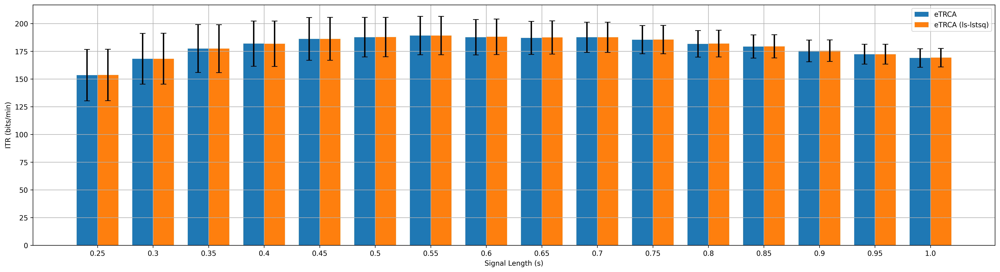
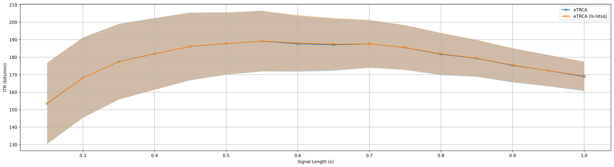

.. role::  raw-html(raw)
    :format: html

Example 3: How to plot recognition performance
-----------------------------------------------------

After the 2nd example, we get the recognition performance. This example shows how to use the build-in functions to plot recognition performance.

You can find the related code in :file:`demo/plot_performance.py` or :file:`demo/plot_performance.ipynb`.

In the 2nd example, we stored the results in
``res/benchmarkdataset_res.mat``. Firstly, we need to reload these
results.

.. code:: ipython3

    from SSVEPAnalysisToolbox.utils.io import loaddata
    data_file = 'res/benchmarkdataset_res.mat'
    data = loaddata(data_file, 'mat')
    acc_store = data["acc_store"]
    itr_store = data["itr_store"]
    train_time = data["train_time"]
    test_time = data["test_time"]
    tw_seq = data["tw_seq"]
    method_ID = data["method_ID"]
    method_ID = [name.strip() for name in method_ID]

Then, we can use the build-in function to plot the recognition accuracy
and ITR by using bar charts, and save the corresponding figures.

.. code:: ipython3

    from SSVEPAnalysisToolbox.evaluator import bar_plot_with_errorbar
    sub_title = 'benchmark'
    
    fig, _ = bar_plot_with_errorbar(acc_store,
                                    x_label = 'Signal Length (s)',
                                    y_label = 'Acc',
                                    x_ticks = tw_seq,
                                    legend = method_ID,
                                    errorbar_type = '95ci',
                                    grid = True,
                                    ylim = [0, 1],
                                    figsize=[6.4*3, 4.8])
    fig.savefig('res/{:s}_acc_bar.jpg'.format(sub_title), bbox_inches='tight', dpi=300)

.. code:: ipython3

    fig, _ = bar_plot_with_errorbar(itr_store,
                                    x_label = 'Signal Length (s)',
                                    y_label = 'ITR (bits/min)',
                                    x_ticks = tw_seq,
                                    legend = method_ID,
                                    errorbar_type = '95ci',
                                    grid = True,
                                    figsize=[6.4*3, 4.8])
    fig.savefig('res/{:s}_itr_bar.jpg'.format(sub_title), bbox_inches='tight', dpi=300)

We also can plot the recognition accuracy and ITR by using the shadow
lines, and save the corresponding figures.

.. code:: ipython3

    from SSVEPAnalysisToolbox.evaluator import shadowline_plot
    fig, _ = shadowline_plot(tw_seq,
                            acc_store,
                            'x-',
                            x_label = 'Signal Length (s)',
                            y_label = 'Acc',
                            legend = method_ID,
                            errorbar_type = '95ci',
                            grid = True,
                            ylim = [0, 1],
                            figsize=[6.4*3, 4.8])
    fig.savefig('res/{:s}_acc_shadowline.jpg'.format(sub_title), bbox_inches='tight', dpi=300)

.. code:: ipython3

    fig, _ = shadowline_plot(tw_seq,
                            itr_store,
                            'x-',
                            x_label = 'Signal Length (s)',
                            y_label = 'ITR (bits/min)',
                            legend = method_ID,
                            errorbar_type = '95ci',
                            grid = True,
                            figsize=[6.4*3, 4.8])
    fig.savefig('res/{:s}_itr_shadowline.jpg'.format(sub_title), bbox_inches='tight', dpi=300)

