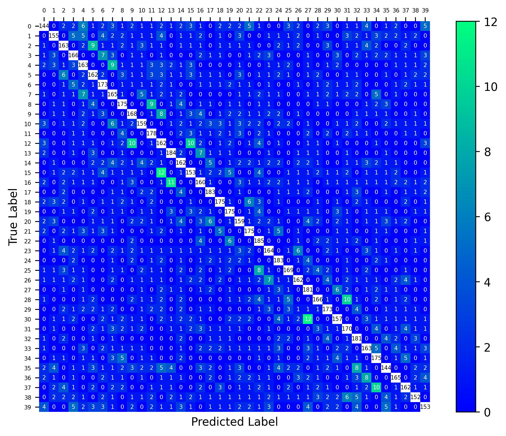

.. role::  raw-html(raw)
    :format: html

Example 4: How to plot confusion matrix
-----------------------------------------------------

This example shows how to directly use ``imshow`` in ``matplotlib`` to plot the confusion matrix generated by the build-in function. You also can use ``heatmap`` [#heatmap]_ in ``seaborn`` or ``plot_confusion_matrix`` [#plot_confusion_matrix]_ in ``sklearn`` to plot the confusion matrix. 

.. [#heatmap] `Plot confusion matrices using seaborn <https://www.stackvidhya.com/plot-confusion-matrix-in-python-and-why/>`_
.. [#plot_confusion_matrix] `Plot confusion matrices using sklearn <https://scikit-learn.org/stable/modules/generated/sklearn.metrics.plot_confusion_matrix.html>`_

You can find the related code in :file:`demo/plot_confusion_matrix.py` or :file:`demo/plot_confusion_matrix.ipynb`.

In the 2nd example, we already generated the confusion matrices and
stored them in ``res/benchmarkdataset_res.mat``. So, firstly, we need to
reload these confusion matrices. In this example, we only consider the
results of 0.5s signal length.

.. code:: ipython3

    import sys
    sys.path.append('..')
    from SSVEPAnalysisToolbox.utils.io import loaddata
    data_file = 'res/benchmarkdataset_res.mat'
    data = loaddata(data_file, 'mat')
    confusion_matrix = data["confusion_matrix"]
    method_ID = data["method_ID"]
    tw_seq = data["tw_seq"]
    
    import numpy as np
    target_time = 0.5
    signal_len_idx = int(np.where(np.array(tw_seq)==target_time)[0])

We also want to display the confusion matrix from low stimulus frequency
to high stimulus frequency. Therefore, we also need the stimulus
frequency information. Because such information can be found in dataset,
we recreate the dataset and read the information.

.. code:: ipython3

    from SSVEPAnalysisToolbox.datasets import BenchmarkDataset
    dataset = BenchmarkDataset(path = '2016_Tsinghua_SSVEP_database')
    freqs = dataset.stim_info['freqs']
    sort_idx = list(np.argsort(freqs))

In the 2nd example, we evaluate multiple methods’ performance. This
example only consider the 1st method, i.e., sCCA method. We can get the
corresponding confusion matrix and plot it.

.. code:: ipython3

    method_idx = 0
    confusion_matrix_plot = confusion_matrix[method_idx, :, signal_len_idx, :, :]
    confusion_matrix_plot = np.sum(confusion_matrix_plot, axis = 0)
    confusion_matrix_plot = confusion_matrix_plot[sort_idx,:]
    confusion_matrix_plot = confusion_matrix_plot[:,sort_idx]
    N, _ = confusion_matrix_plot.shape
    min_v = 0
    max_v = np.amax(np.reshape(confusion_matrix_plot - np.diag(np.diag(confusion_matrix_plot)),(-1)))
    
    import matplotlib.pyplot as plt
    import matplotlib.patches as pach
    
    fig = plt.figure()
    ax = fig.add_axes([0,0,1,1])
    
    im = ax.imshow(confusion_matrix_plot,
                    interpolation = 'none',
                    origin = 'upper',
                    vmin = min_v,
                    vmax = max_v,
                    cmap='winter')
    
    for n in range(N):
        ax.add_patch(
            pach.Rectangle(xy=(n-0.5, n-0.5), width=1, height=1, facecolor='white')
        )
    for i in range(N):
        for j in range(N):
            if i==j:
                text_color = 'black'
            else:
                text_color = 'white'
            ax.text(i,j,"{:n}".format(int(confusion_matrix_plot[j,i])),
                fontsize=5,
                horizontalalignment='center',
                verticalalignment='center',
                color=text_color)
    ax.figure.colorbar(im, ax=ax)
    ax.set_xticks(list(range(N)))
    ax.set_yticks(list(range(N)))
    ax.spines[:].set_visible(False)
    ax.grid(which="minor", color="black", linestyle='-', linewidth=10)
    ax.tick_params(top=True, bottom=False,
                    labeltop=True, labelbottom=False)
    ax.tick_params(which="minor", bottom=False, left=False)
    ax.tick_params(axis='x',labelsize=5)
    ax.tick_params(axis='y',labelsize=5)
    ax.set_ylabel('True Label')
    ax.set_xlabel('Predicted Label')

Finally, we can save this figure.

.. code:: ipython3

    save_path = 'res/confusion_matrix_sCCA(qr)_T{:n}.jpg'.format(tw_seq[signal_len_idx])
    fig.savefig(save_path, 
                bbox_inches='tight', dpi=300)
