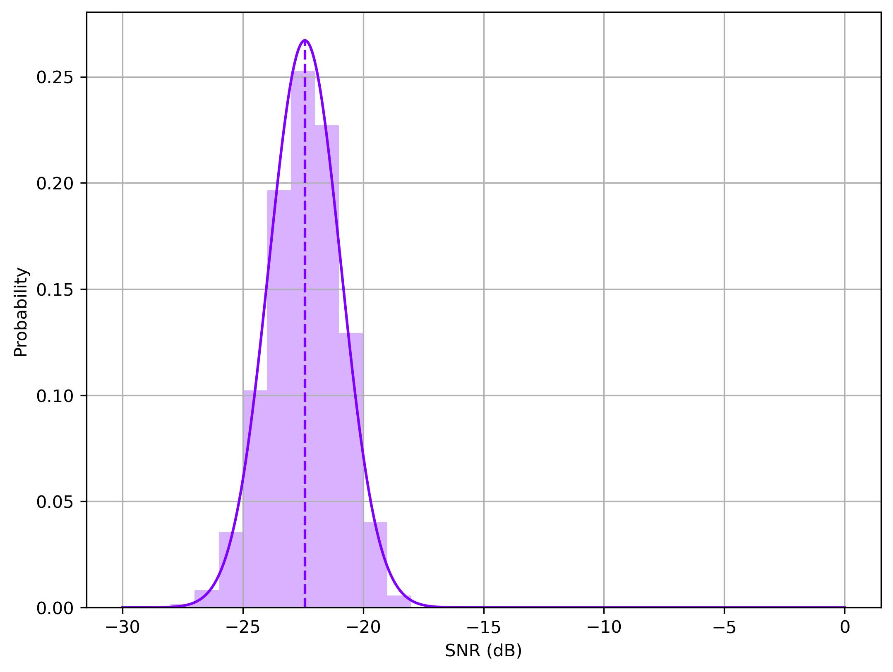
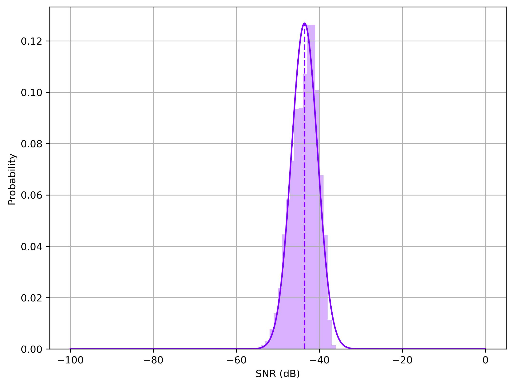

.. role::  raw-html(raw)
    :format: html

Example 5: How to plot the SNR
-----------------------------------------------------

After collecting EEG signals, checking or exploring characteristics of these signals is critical. For SSVEP signals, the signal-to-noise ratio (SNR) is one important characteristic. This example shows how to use the build-in function to calculate SNRs of the SSVEP signals. 

You can find the related code in :file:`demo/plot_snr.py` or :file:`demo/plot_snr.ipynb`.

The Benchmark Dataset is applied as an example. Firstly, we need to
initialize the dataset.

.. code:: ipython3

    import sys
    sys.path.append('..')
    from SSVEPAnalysisToolbox.datasets import BenchmarkDataset
    from SSVEPAnalysisToolbox.utils.benchmarkpreprocess import (
        preprocess, filterbank
    )
    dataset = BenchmarkDataset(path = '2016_Tsinghua_SSVEP_database')
    dataset.regist_preprocess(preprocess)
    dataset.regist_filterbank(filterbank)

We provide 2 types of methods for computing the SNR. The 1st method
directly uses the FFT and use the spectrum amplitudes to calculate the
SNR. In this example, we consider first 5 harmonic components and first
1 second signal length. This example only considers 9 occipital
channels.

.. code:: ipython3

    harmonic_num = 5
    sig_len = 1
    from SSVEPAnalysisToolbox.utils.benchmarkpreprocess import suggested_ch
    from SSVEPAnalysisToolbox.utils.algsupport import nextpow2
    snr = dataset.get_snr(Nh = harmonic_num, display_progress = True, 
                        sig_len = sig_len,
                        remove_break = False, remove_pre_and_latency = False,
                        NFFT = 2 ** nextpow2(10*dataset.srate)) 
    snr = snr[:,:,:,suggested_ch()]

.. parsed-literal::

    100.000%|████████████████████████████████████████████████████████████████████████████████████████████████| 210/210 [Time: 06:24<00:00]
    

Then, we can plot the histogram of these SNR values.

.. code:: ipython3

    from SSVEPAnalysisToolbox.evaluator import (
        hist, gen_colors
    )
    hist_bins = list(range(-30,0+1))
    hist_range = (-30, 0)
    color = gen_colors(1)
    fig, ax = hist(snr, bins = hist_bins, range = hist_range, density = True,
                color = color, alpha = 0.3, fit_line = True, line_points = 1000,
                x_label = 'SNR (dB)',
                y_label = 'Probability',
                grid = True)
    fig.savefig('res/SNR_fft_benchmark.jpg', bbox_inches='tight', dpi=300)

The 2nd method use the sine-cosine to compute the multi-channel SNR.

.. code:: ipython3

    snr = dataset.get_snr(type = 'sine', ch_used_recog=suggested_ch(), display_progress = True)
    
    hist_bins = list(range(-100,0+1))
    hist_range = (-100, 0)
    
    fig, ax = hist(snr, bins = hist_bins, range = hist_range, density = True,
                color = color, alpha = 0.3, fit_line = True, line_points = 1000,
                x_label = 'SNR (dB)',
                y_label = 'Probability',
                grid = True)
    fig.savefig('res/SNR_sine_benchmark.jpg', bbox_inches='tight', dpi=300)

.. parsed-literal::

    100.000%|████████████████████████████████████████████████████████████████████████████████████████████████| 210/210 [Time: 07:35<00:00]
    

