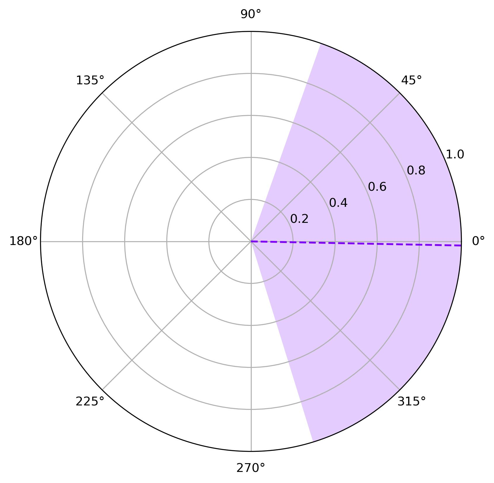

.. role::  raw-html(raw)
    :format: html

Example 6: How to plot the phase
-----------------------------------------------------

Except the SNR calculated in the 5th example, the phase synchronization is another important characteristic that affects the recognition performance. This example shows how to use the build-in function to calculate phases of the SSVEP signals. 

You can find the related code in :file:`demo/plot_phase.py` or :file:`demo/plot_phase.ipynb`.

The Benchmark Dataset is applied as an example. Firstly, we need to
initialize the dataset.

.. code:: ipython3

    from SSVEPAnalysisToolbox.datasets import BenchmarkDataset
    from SSVEPAnalysisToolbox.utils.benchmarkpreprocess import (
        preprocess, filterbank
    )
    dataset = BenchmarkDataset(path = '2016_Tsinghua_SSVEP_database')
    dataset.regist_preprocess(preprocess)
    dataset.regist_filterbank(filterbank)

This example uses first 1 second signal length and only consider 9
occipital channel to compute the phases.

.. code:: ipython3

    sig_len = 1
    from SSVEPAnalysisToolbox.utils.algsupport import nextpow2
    from SSVEPAnalysisToolbox.utils.benchmarkpreprocess import suggested_ch
    phase = dataset.get_phase(display_progress = True, 
                          sig_len = sig_len,
                          remove_break = False, remove_pre_and_latency = False, remove_target_phase = True,
                          NFFT = 2 ** nextpow2(10*dataset.srate)) # filterbank index is 0
    phase_list = phase[:,:,:,suggested_ch()]

.. parsed-literal::

    100.000%|████████████████████████████████████████████████████████████████████████████████████████████████| 210/210 [Time: 06:23<00:00]
    

Then, we can plot the phase distribution.

.. code:: ipython3

    from SSVEPAnalysisToolbox.evaluator import (
        polar_phase_shadow, gen_colors
    )
    color = gen_colors(1)
    fig, ax = polar_phase_shadow(phase_list,
                                color = color,
                                grid = True,
                                errorbar_type = 'std')
    fig.savefig('res/phase_benchmark.jpg', bbox_inches='tight', dpi=300)

