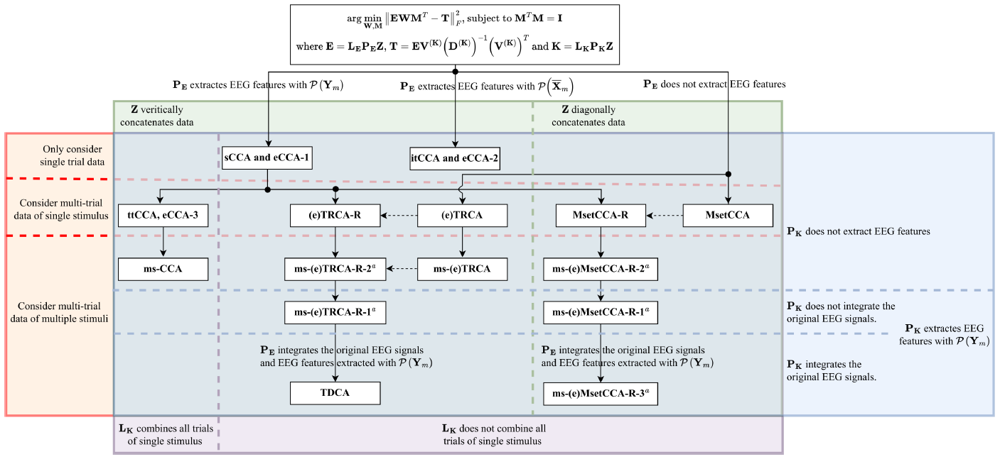

.. role::  raw-html(raw)
    :format: html

Comparisons of CA-based Spatial Filtering Algorithms
------------------------------------------------------------

Compare computation strategies of spatial filters
^^^^^^^^^^^^^^^^^^^^^^^^^^^^^^^^^^^^^^^^^^^^^^^^^^^^^^

Accordng to the LS framework, except :math:`\mathbf{L}_\mathbf{E}` that has same functions for all methods, other parameters have different forms and functions. The spatial filtering computation strategies in the existing CA-based methods can be grouped by 5 categories based on the differences of parameters in the LS framework:

1. How to extract inter-class features, which is related to :math:`\mathbf{P}_\mathbf{E}`;
2. How to concatenate data in :math:`\mathbf{Z}`;
3. Which data is applied for the spatial filtering computation, which is related to the data types included in :math:`\mathbf{Z}`;
4. How to combine intra-class features, which is related to :math:`\mathbf{L}_\mathbf{K}`;
5. How to extract intra-class features, which is related to :math:`\mathbf{P}_\mathbf{K}`.

These computation strategies can be summarized as following image:

Compare utilization strategies of spatial filters
^^^^^^^^^^^^^^^^^^^^^^^^^^^^^^^^^^^^^^^^^^^^^^^^^^^^^^^

All CA-based methods follow the same computation paradigm:

1. The correlation coefficients of the processed EEG signals and the calibration signals or the SSVEP reference signals for all stimuli are calculated. The correlation coefficients of the m-th stimulus can be computed by

    .. math::

        \mathbf{r}_m={\left(\widehat{\widehat{\mathbf{W}}}_m\right)^T\widehat{\widehat{\mathbf{Z}}}^T\widehat{\widehat{\mathbf{Y}}}_m\widehat{\widehat{\mathbf{V}}}_m}\left/ {\sqrt{\left(\widehat{\widehat{\mathbf{W}}}_m\right)^T\widehat{\widehat{\mathbf{Z}}}^T\widehat{\widehat{\mathbf{Z}}}\widehat{\widehat{\mathbf{W}}}_m\left(\widehat{\widehat{\mathbf{V}}}_m\right)^T\left(\widehat{\widehat{\mathbf{Y}}}_m\right)^T\widehat{\widehat{\mathbf{Y}}}_m\widehat{\widehat{\mathbf{V}}}_m}} \right.\;,

    where :math:`\widehat{\widehat{\mathbf{Z}}}` denotes the reorganized processed EEG signal, :math:`\widehat{\widehat{\mathbf{W}}}_m` is the spatial filter of the :math:`m\text{-th}` stimulus in the recognition process, :math:`\widehat{\widehat{\mathbf{Y}}}_m` is the calibration signals or the SSVEP reference signals of the :math:`m\text{-th}` stimulus in the recognition process, :math:`\widehat{\widehat{\mathbf{V}}}_m` contains the harmonic weights of the :math:`m\text{-th}` stimulus in the recognition process.

2. The CA-based methods combine all elements in :math:`\mathbf{r}_m` for each stimulus.

3. The stimulus with the highest combined correlation coefficient is regarded as the target. 

The major differences are the strategies of constructing :math:`\widehat{\widehat{\mathbf{W}}}_m`, :math:`\widehat{\widehat{\mathbf{Z}}}`,  :math:`\widehat{\widehat{\mathbf{V}}}_m`, :math:`\widehat{\widehat{\mathbf{Y}}}_m` and the combined correlation coefficients. These strategies can be summarized as four types:

1. Directly apply the obtained spatial filters and the SSVEP template/reference signals: sCCA, itCCA, ttCCA, TRCA, ms-CCA, ms-TRCA and TDCA. Note: These methods only contain one element in :math:`\mathbf{r}_m`.

2. Integrate spatial filters obtained from different methods: eCCA.

3. Combine spatial filters of multiple stimuli: eTRCA, eTRCA-R and ms-eTRCA.

4. Assume that the spatial filters of different trials are different, combine these spatial filters of various trials: MsetCCA and MsetCCA-R.

Performance Comparisons
^^^^^^^^^^^^^^^^^^^^^^^^^^^^^^^^^

By using this toolbox, we can easily test recognition performance of various methods in different datasets. Then, the method with the best performance and the corresponding strategies in each dataset can be found. The following two tables summarize the results:

+ Methods with highest averaged accuracy of small signal length (0.25s) in five datasets:

    .. image:: ../_static/methods_with_best_acc.png

+ Methods with highest averaged ITR in five public SSVEP datasets:

    .. image:: ../_static/methods_with_best_itr.png

The detailed results are shown below for your references:

+ Benchmark Dataset:

    .. image:: ../_static/Plot_All_Performance_benchmark.png

+ BETA Dataset:

    .. image:: ../_static/Plot_All_Performance_beta.png

+ eldBETA Dataset:

    .. image:: ../_static/Plot_All_Performance_eldbeta.png

+ Nakanishi 2015 Dataset:

    .. image:: ../_static/Plot_All_Performance_nakanishi.png

+ Wearable Dataset (dry electrodes):

    .. image:: ../_static/Plot_All_Performance_wearable_dry.png

+ Wearable Dataset (wet electrodes):

    .. image:: ../_static/Plot_All_Performance_wearable_wet.png