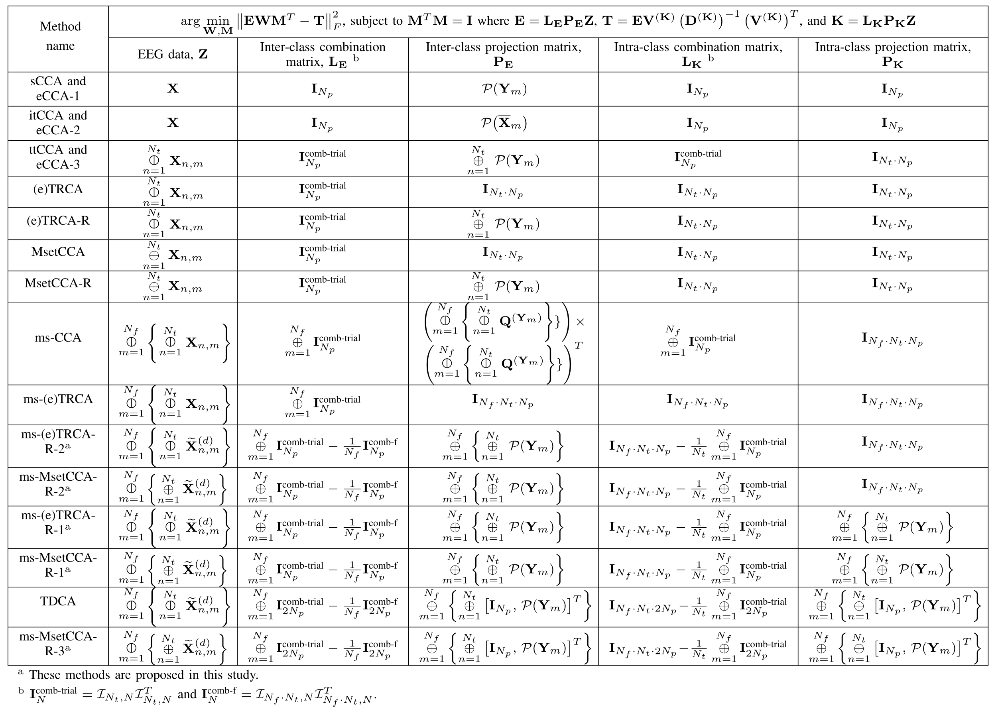

.. role::  raw-html(raw)
    :format: html

Unified Framework
----------------------

LS framework
^^^^^^^^^^^^^^^^^^^^^^^^^^^

Various CA-based SSVEP spatial filtering methods can be formulated as one kind of RRR problems:

.. math::

    \arg\min_{\mathbf{W},\mathbf{M}} \left\|
		\mathbf{E}\mathbf{W}\mathbf{M}^T-\mathbf{T}
		\right\|^2_F,

.. math::

    \text{subject to } \mathbf{M}^T\mathbf{M}=\mathbf{I},

where :math:`\mathbf{W}` is the spatial filter. In principle, the matrix :math:`\mathbf{E}` presents the combined EEG features of inter-classes, i.e., 

.. math::

    \mathbf{E}=\mathbf{L}_\mathbf{E}\mathbf{P}_\mathbf{E}\mathbf{Z},

where :math:`\mathbf{L}_\mathbf{E}` denotes the combination matrix of inter-class EEG features, :math:`\mathbf{P}_\mathbf{E}` denotes the orthogonal matrix applied for generating inter-class EEG features, and :math:`\mathbf{Z}` denotes the EEG data. In addition, the matrix :math:`\mathbf{T}` is

.. math::

    \mathbf{T}=\mathbf{E}\,\mathcal{S}\!\left(\mathbf{K}\right).

Similarly as :math:`\mathbf{E}`, :math:`\mathbf{K}` presents the combined EEG features of intra-classes, i.e., 

.. math::

    \mathbf{K}=\mathbf{L}_\mathbf{K}\mathbf{P}_\mathbf{K}\mathbf{Z},

where :math:`\mathbf{L}_\mathbf{K}` denotes the combination matrix of intra-class EEG features, and :math:`\mathbf{P}_\mathbf{K}` denotes the orthogonal matrix applied for generating intra-class EEG features. 

Parameters in LS framework
^^^^^^^^^^^^^^^^^^^^^^^^^^^^^^^^

In the LS framework,

    1. The matrices :math:`\mathbf{L}_\mathbf{E}` and :math:`\mathbf{P}_\mathbf{E}` are related to the inter-class features. 
    
    2. The matrices :math:`\mathbf{L}_\mathbf{K}` and :math:`\mathbf{P}_\mathbf{K}` are related to the intra-class features. 
	
    3. :math:`\mathbf{L}_\mathbf{E}` and :math:`\mathbf{L}_\mathbf{K}` present how to combine EEG features of inter- and intra-classes, respectively. 
    
    4. :math:`\mathbf{P}_\mathbf{E}` and :math:`\mathbf{P}_\mathbf{K}` are the orthogonal projection matrices that extract EEG features of inter- and intra-classes, respectively. 
	
    5. The combined intra-class features :math:`\mathbf{K}` can be regarded as the normalization item of the combined inter-class features :math:`\mathbf{E}` in the output of the LS regression :math:`\mathbf{T}`.

The parameters in the propsoed LS framework of the CA-based methods are summarized in the following table:

Spatial filtering computation based on LS framework
^^^^^^^^^^^^^^^^^^^^^^^^^^^^^^^^^^^^^^^^^^^^^^^^^^^^^^^^

1. Initilize :math:`\mathbf{M}`: 

    .. math::

        \mathbf{M}=\mathbf{V}^{\left( \mathbf{T} \right)}\text{ where }\mathbf{V}^{\left( \mathbf{T} \right)}\text{ is obtained from the SVD of }\mathbf{T}.

2. Update :math:`\mathbf{W}`:

    .. math::

        \mathbf{W}=\left(\mathbf{E}^T\mathbf{E}\right)^{-1}\mathbf{E}^T\mathbf{T}\mathbf{M}.

3. Update :math:`\mathbf{M}`:

    .. math::

        \mathbf{M}=\mathbf{U}^{\left(\mathbf{P}\right)}\left(\mathbf{V}^{\left(\mathbf{P}\right)}\right)^T.\text{ where }\mathbf{U}^{\left(\mathbf{P}\right)}\text{ and }\mathbf{V}^{\left(\mathbf{P}\right)}\text{ are obtained from the SVD of }\mathbf{P}

4. Repeat the steps 2 and 3 until :math:`\mathbf{W}` and :math:`\mathbf{M}` are converged. 