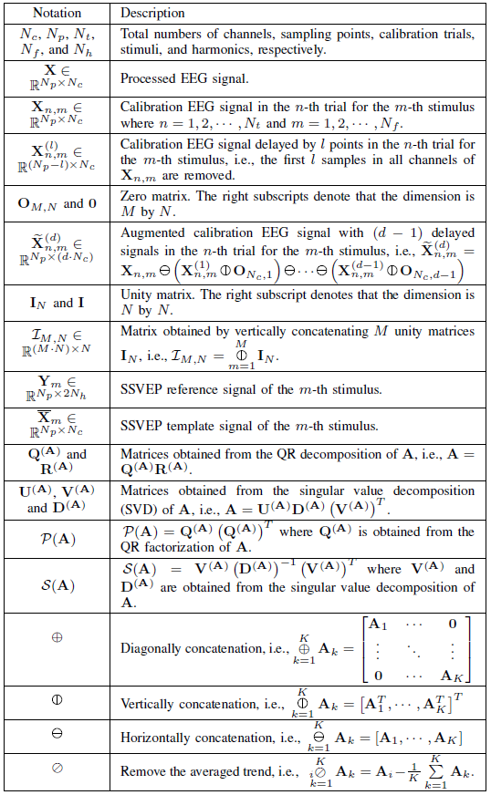

.. role::  raw-html(raw)
    :format: html

Priliminaries
-------------------

Before we introduce the LS framework, we need to show the key notations and basic knowledge that will be used in following sections.

Key Notations 
^^^^^^^^^^^^^^^^^^

SSVEP reference and template signals
^^^^^^^^^^^^^^^^^^^^^^^^^^^^^^^^^^^^^^^^

The well-known SSVEP reference signal is constructed as a set of sine-cosine signals, which can be presented as

.. math::

    \mathbf{Y}_m=\left[
		\begin{array}{c}
			\sin\left(2\pi f_m t+\theta_m\right)\\
			\cos\left(2\pi f_m t+\theta_m\right)\\
			\vdots\\
			\sin\left(2\pi N_h f_m t+N_h\theta_m\right)\\
			\cos\left(2\pi N_h f_m t+N_h\theta_m\right)
		\end{array}
		\right]^T,

where :math:`f_m` and :math:`\theta_m` denote the frequency and phase of the :math:`m`-th stimulus. 

The SSVEP template signals are normally computed as the average of signals over all calibration trials, i.e.,

.. math::

    \overline{\mathbf{X}}_m=\frac{1}{N_t}\sum_{n=1}^{N_t}\mathbf{X}_{n,m}.

QR factorization
^^^^^^^^^^^^^^^^^^^^^^^^^^^^^^^^^^^^^^^^

The QR factorization of a square matrix :math:`\mathbf{A}` decomposes :math:`\mathbf{A}` into the production of an orthonormal matrix :math:`\mathbf{Q}^{(\mathbf{A})}`, and an upper
triangular matrix :math:`\mathbf{R}^{(\mathbf{A})}`, which can be expressed as

.. math::

    \mathbf{A}=\mathbf{Q}^{(\mathbf{A})}\mathbf{R}^{(\mathbf{A})}.

To simplify expressions in following sections, we define a new operation of :math:`\mathbf{A}`:

.. math::

    \,\mathcal{P}\!\left(\mathbf{A}\right) = \mathbf{A}\left(\mathbf{A}^T\mathbf{A}\right)^{-1}\mathbf{A}^T=\mathbf{Q}^{(\mathbf{A})}\left(\mathbf{Q}^{(\mathbf{A})}\right)^T.

Singular value decomposition (SVD)
^^^^^^^^^^^^^^^^^^^^^^^^^^^^^^^^^^^^^^^^

The SVD of a matrix :math:`\mathbf{A}` decomposes :math:`\mathbf{A}` into the production of an orthonormal matrix :math:`\mathbf{U}^{(\mathbf{A})}`, a rectangular diagonal matrix :math:`\mathbf{D}^{(\mathbf{A})}`, and another orthonormal matrix :math:`\mathbf{V}^{(\mathbf{A})}`, which can be

.. math::

    \mathbf{A} = \mathbf{U}^{(\mathbf{A})}\mathbf{D}^{(\mathbf{A})}\left(\mathbf{V}^{(\mathbf{A})}\right)^T.

Let :math:`\mathbf{\Sigma}^{(\mathbf{A})}=\mathbf{A}^T\mathbf{A}=\mathbf{V}^{(\mathbf{A})}\left(\mathbf{D}^{(\mathbf{A})}\right)^2\left(\mathbf{V}^{(\mathbf{A})}\right)^T`, we define a new operation to simplify expressions in following section:

.. math::

    \,\mathcal{S}\!\left(\mathbf{A}\right) = \left(\mathbf{\Sigma}^{(\mathbf{A})}\right)^{-\frac{1}{2}}=\mathbf{V}^{(\mathbf{A})}\left(\mathbf{D}^{(\mathbf{A})}\right)^{-1}\left(\mathbf{V}^{(\mathbf{A})}\right)^T.